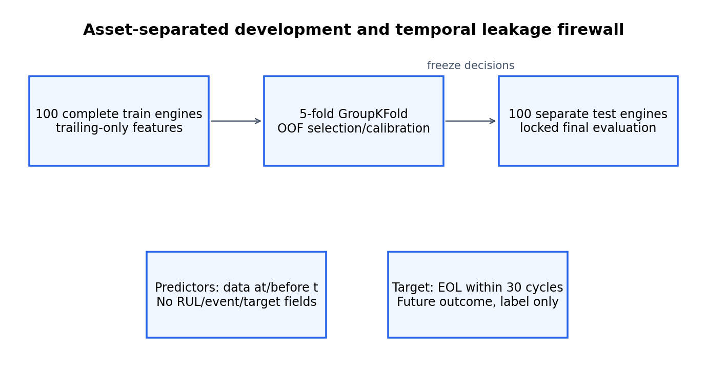

# Continuous FMEA Risk Monitoring

**Condition-informed FMEA decision support prototype · Technical portfolio prototype**

This project combines a governed, static FMEA scenario with a separate condition model for NASA C-MAPSS FD001. The model estimates whether simulated end of useful life falls within the next 30 cycles; a transparent decision layer can then change review urgency without changing Severity, Occurrence, Detection, or static RPN.

The portfolio version is a deliberate rebuild of earlier graduate coursework. During reconstruction, the historical predictive target was found to be circular and unsuitable for predictive-performance claims. Replacing that target with an independently defined future event—and validating the replacement aggressively—is central to the project, not a detail hidden from view.

> **Scope:** `CONDITION_INFORMED_FMEA_DECISION_SUPPORT_PROTOTYPE` / `TECHNICAL_PROTOTYPE`. This is not a production predictive-maintenance system, a real turbofan deployment, a dynamic-RPN standard, proof that ML improves FMEA, or a certified safety/maintenance system.

## Why the rebuild was necessary

The historical implementation created an RPN-like score from vibration, temperature, and current threshold flags plus noise, then used those same sensor variables to predict the score. Favorable fit therefore measured recovery of a visible scoring recipe rather than prediction of an independent future outcome. It also used a random row split instead of asset-separated temporal evidence.

The historical artifacts remain preserved as private coursework provenance under `HISTORICAL_INVALIDATED_APPROACH`, but their predictive scores are not reused. The rebuilt project instead predicts a separate future degradation-event label, preserves the official asset split, and constructs every predictor from information available at or before the prediction cycle. The detailed historical audit remains outside this repository.

## Dataset and data rights

The analytical benchmark is **NASA C-MAPSS FD001**:

- 100 complete development engines and 20,631 development rows;
- 100 separately simulated, truncated official-test engines and 13,096 released test rows;
- three operating settings and 21 anonymized sensor channels;
- one simulated operating condition and one documented HPC degradation mode; and
- official final-RUL truth used only to reconstruct test event timing and evaluation labels.

This is simulated benchmark data, not field maintenance data.

`DATA_PROVENANCE = PUBLIC_VERIFIED`  
`REDISTRIBUTION_STATUS = VERIFY_BEFORE_PUBLICATION`

NASA provides public access but its dataset record does not specify a redistribution license. Raw files are therefore kept in a private runtime cache outside this repository. Row- and asset-level NASA-derived outputs also remain outside the repository pending rights review. Acquisition, expected filenames, hashes, and preparation steps are documented in [data/README.md](data/README.md) and [data_rights.md](docs/data_rights.md).

## Prediction task

For asset `i` at cycle `t`, with simulated event cycle `Eᵢ`:

```text
Y(i,t;30) = 1  iff  0 ≤ Eᵢ − t ≤ 30
```

The horizon is **30 cycles inclusive**. It is a predeclared portfolio scenario, not an industry standard or a value tuned against the official test. Development event cycles are the final run-to-failure cycles. Official-test event cycles are `last_observed_cycle + provided_final_RUL`; final RUL is an evaluation field and never a predictor.

## Leakage controls

```text
information available through cycle t
        ↓
current + right-aligned trailing features
        ↓
grouped-development risk model
        ↓
event within the next 30 cycles
```

The implementation enforces:

- the official NASA development/test split;
- five-fold `GroupKFold` development by engine;
- right-aligned current/trailing features only;
- fold-local imputation and scaling inside scikit-learn pipelines;
- a predictor firewall against RUL, event cycle, target, future, S/O/D, and RPN-derived fields;
- separate train/test feature construction; and
- a future-value perturbation test with maximum earlier-feature and earlier-prediction deltas of `0.0`.

Future RUL, future sensor rows, future rolling statistics, per-asset maximum cycle, and whole-lifetime normalization are prohibited. See [leakage_controls.md](docs/leakage_controls.md).



## Feature groups

| Feature group | Count | Contents |
|---|---:|---|
| `AGE_ONLY` | 1 | Current engine cycle/age |
| `CURRENT_SENSORS` | 14 | Predeclared nonconstant current sensor values |
| `CURRENT_PLUS_ROLLING` | 56 | Current sensors, six from-initial deviations, and 36 trailing summaries |
| `FULL_PARSIMONIOUS_FEATURE_SET` | 59 | The 56 condition features plus age and two nonconstant settings |

All importance and ablation results are predictive associations within this setup. They are not causal sensor-physics conclusions.

## Models and selection policy

The project evaluates only:

- regularized Logistic Regression; and
- a fixed 200-tree, depth-10 Random Forest.

The primary selection metric is engine-grouped development out-of-fold PR-AUC. Logistic Regression scored `0.979969253`; Random Forest scored `0.970112515`. A transparent, predeclared policy required Random Forest to improve on Logistic Regression by more than `0.01` before displacing it. That did not occur, so Logistic Regression remained selected. The `0.01` gate is a project model-selection policy, not a universal statistical law.

## Validated technical results

PR-AUC is the headline metric because official-test positives are rare. ROC-AUC is retained as secondary benchmark context and must not be restated as “accuracy.”

| Result | Validated value |
|---|---:|
| Development OOF PR-AUC | `0.979969253` |
| Locked-test PR-AUC | `0.905130191` |
| Locked-test ROC-AUC | `0.996893324` |
| Locked-test Brier score | `0.007012987` |
| Development-selected threshold | `0.871048942` |
| Event-eligible test engines | `25` |
| Qualifying warning coverage | `16/25 = 64%` |
| Wilson 95% interval for coverage | approximately `44.5%–79.8%` |
| Median qualifying first-warning lead | `22 cycles` |
| Target-negative alert rows | `4` |
| False-alert episodes | `2` |

The high ROC-AUC is plausible for FD001, but the benchmark formulation makes discrimination easier than real field failure prediction: positives are contiguous terminal-window rows, rows within an engine are correlated, age and simulated degradation trajectories are informative, and official-test truncation creates many released histories with no positive row. Equal-asset and eligible-only checks remained strong during validation, but they do not establish external validity.

Development prevalence is **15.026%**; released official-test prevalence is **2.535%**. Truncation explains most of that difference and materially affects calibration and threshold transfer.

## Calibration and threshold discipline

Nested grouped sigmoid calibration was tested using development data only. Development OOF Brier changed from `0.017961356` to `0.017836767`, an improvement of about `0.000125`, below the predefined `0.001` retention gate. The calibrated mapping was rejected and raw Logistic Regression probabilities were retained. The model is not described as perfectly calibrated, and calibration is not assumed to transfer to another fleet or prevalence.

The warning threshold `0.871048942` is the highest grouped-development OOF score meeting at least 80% development row recall. Official-test labels did not select or tune it. Bounded sensitivity checks found:

- at threshold ±0.01: coverage remained 64% and false-alert rows remained 4;
- at threshold −0.02: coverage was 76%; and
- at threshold +0.02: coverage was 60%.

The selected threshold achieved 50.9% row recall on the truncated official test. “80% recall” is therefore a development policy target, not a transported guarantee.

## Event-level evidence and uncertainty

Only **25 of 100** official-test engines release at least one row inside the 30-cycle target window. Of those, **16 received a qualifying warning**, giving 64% coverage with a Wilson 95% interval of approximately **44.5%–79.8%**. Median first-warning lead among warned eligible engines was 22 cycles.

Coverage also depends on unequal released follow-up: engines truncated closer to the event provide more opportunities to warn. The 64% estimate is consequently descriptive benchmark evidence, not a stable production-performance rate. All 100 official-test engines remain in the false-alert exposure calculation.

The example is engine 24, selected after model lock as the warned eligible engine nearest the median lead time, with asset ID as the tie-break. It is illustrative, not a best-case or a claim of typical field behavior.

## FMEA layer

The three-row HPC FMEA is an `ENGINEERING_SCENARIO_ASSUMPTION`. It records effects, causes, controls, Severity, Occurrence, Detection, and `Static_RPN = S × O × D` as human-governed engineering context. C-MAPSS does not supply labels for the three illustrative submodes, and the ratings require domain review.

The model probability remains separate. It does **not** become a failure-mode probability, replace Occurrence, modify Detection, or create a dynamic RPN. Fixed urgency bands at `0.20`, `0.50`, and `0.80` are `PORTFOLIO_SCENARIO_ASSUMPTION` values—not validated industrial limits or IEC/ISO thresholds.

## Illustrative static-versus-condition policies

Under the defined scenario policies, the validated test results were:

| Policy | Eligible coverage | Median lead | Negative alert rows | Episodes |
|---|---:|---:|---:|---:|
| Frozen static age/inspection proxy | 28% | 24 cycles | 277 | 7 |
| Condition threshold | 64% | 22 cycles | 4 | 2 |

This is a **scenario policy illustration**, not an operational superiority test. The policies were nearly matched only on development alert-state rows. They were **not** matched on inspected assets, alert/inspection episodes, maintenance hours, cost, asset-level workload, or resource constraints. The result does not establish that condition monitoring is superior to static FMEA or that ML improves FMEA in practice.

## Ablation and model interpretation

| Feature group | Development OOF PR-AUC |
|---|---:|
| `AGE_ONLY` | `0.50841` |
| `CURRENT_SENSORS` | `0.94781` |
| `CURRENT_PLUS_ROLLING` | `0.96195` |
| `FULL_PARSIMONIOUS_FEATURE_SET` | `0.97997` |

The progression shows predictive signal beyond simple engine age within grouped FD001 development. Standardized Logistic coefficients are conditional under strongly correlated current/rolling/deviation features and must not be read causally.

## Limitations

- C-MAPSS is simulated benchmark data, not field maintenance data.
- Only 25 official-test engines are event-eligible, with unequal released follow-up.
- Test truncation shifts prevalence from 15.026% to 2.535%.
- High ROC-AUC partly reflects terminal-window, age, correlation, and truncation structure.
- Calibration and threshold transport are uncertain, including within FD001.
- The FMEA mapping, S/O/D values, actions, and condition bands are illustrative assumptions.
- The static comparison is not operationally workload-matched.
- There is no field/domain deployment validation, maintenance-cost model, causal effect, avoided-failure estimate, cybersecurity assessment, safety certification, or standards-compliance claim.
- Raw and row-level NASA-derived data remain excluded pending rights review.

Five NASA-data-derived figures are retained locally but withheld from this repository pending derivative-rights review: target horizon, precision–recall, representative asset/lead time, condition-informed FMEA, and feature importance. The data-independent validation/leakage schematic above is the only included figure.

The full limitation register is [limitations.md](reports/limitations.md), and the reproduction-audit summary is [validation_summary.md](reports/validation_summary.md).

## Reproducibility

From the repository root, with Python 3.12 recommended:

```powershell
python -m venv .venv
.\.venv\Scripts\python.exe -m pip install -r requirements.txt -c constraints-tested.txt
.\.venv\Scripts\python.exe run_analysis.py
```

The runner uses `CMAPSS_DATA_DIR` when set; otherwise it uses the private cache at `../05_OUTPUTS/private_data_cache/FD001`. If the verified files are absent, the runner can acquire them from NASA and validate the recorded hashes. Generated machine-readable outputs remain under `../05_OUTPUTS` and are not automatically public artifacts.

Run tests separately:

```powershell
.\.venv\Scripts\python.exe -m pytest tests -q
```

Randomness is fixed at seed `20260824`; seeds are not searched. Exact environment, output classes, expected runtime, and notebook execution are described in [reproducibility.md](docs/reproducibility.md).

## Repository guide

- `src/` — reusable target, feature, model, calibration, evaluation, event, FMEA, decision, and visualization modules.
- `tests/` — 74 focused tests plus 36 parametrized subtests.
- `notebooks/` — three explanatory clients of the reusable modules/frozen outputs.
- `docs/` — target, leakage, background, data-rights, claims, and reproducibility controls.
- `reports/` — validated technical results and limitations.
- `data/` — acquisition instructions only; no bundled raw dataset.
- `../05_OUTPUTS/` — local runtime, generated, validation, and private-cache material outside the repository.

## Provenance

The project is an expanded portfolio implementation derived from graduate coursework. Historical artifacts remain immutable and separate from the rebuilt code. The public provenance boundary is documented in [PROVENANCE.md](PROVENANCE.md); public claim boundaries are in [public_claims.md](docs/public_claims.md).

## Skills demonstrated

FMEA · condition monitoring · predictive-maintenance analytics · grouped validation · temporal leakage control · probability calibration · event-level evaluation · Logistic Regression · Random Forest · scikit-learn · Python · technical validation · risk communication

## Rights and usage

This repository is public for portfolio review. NASA redistribution, held derivative artifacts, attribution, and licensing remain subject to the boundaries documented in [LICENSE_STATUS.md](LICENSE_STATUS.md) and [data_rights.md](docs/data_rights.md). No public license has been assigned.
